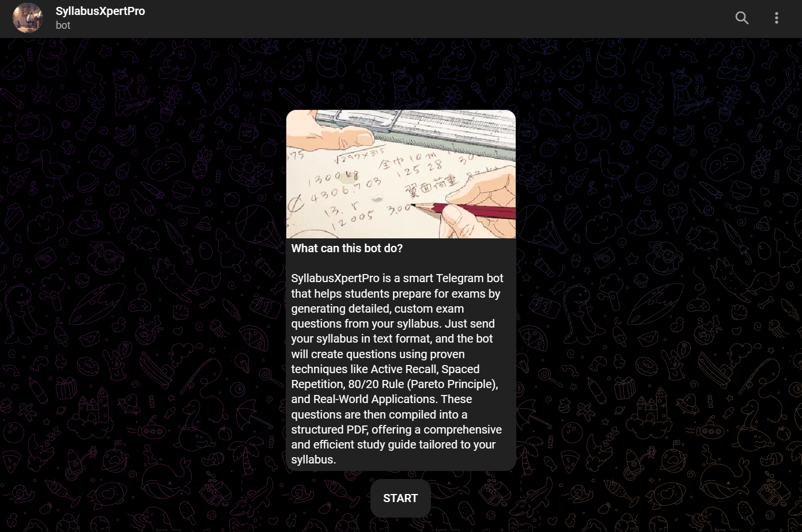

# **SyllabusXpertPro - AI-based Telegram Bot for Exam Question Generation**


**SyllabusXpertPro** is an AI-powered Telegram bot that helps students and professionals generate customized exam questions from their syllabus. Whether you're preparing for exams, revising topics, or looking for a study partner, this bot can create detailed questions that focus on **active recall**, **real-world applications**, and **concept mapping** to help you retain knowledge more effectively.

## **Features**
- **AI-powered exam question generation** based on the syllabus you provide.
- **Active Recall**: Questions that encourage you to actively retrieve and recall information.
- **Real-World Applications**: Questions designed to help you relate theory to practical scenarios.
- **Concept Mapping**: Questions that connect related concepts for a better understanding.
- **PDF Export**: Get the generated questions in a downloadable PDF format for offline study.
- **Rate Limiting**: Protects the bot from being overwhelmed with too many requests in a short period.

## **Technologies Used**
- **Groq API**: AI and Natural Language Processing (NLP) to generate questions based on your syllabus.
- **python-telegram-bot**: Framework for building the Telegram bot.
- **aiohttp**: For handling asynchronous HTTP requests.
- **FPDF**: For generating downloadable PDF files with the generated questions.
- **Rate Limiting**: Ensures the bot remains responsive by limiting request frequency.

## **Getting Started**

### 1. **Clone the Repository**
First, clone the repository to your local machine:
```bash
git clone https://github.com/thesupersaurabh/SyllabusXpertPro.git
cd SyllabusXpertPro
```

### 2. **Install Dependencies**
Install the required Python libraries:
```bash
pip install -r requirements.txt
```

### 3. **Set Up Environment Variables**
Create a `.env` file in the root directory and add your credentials:
```
GROQ_API_KEY=your_groq_api_key
TELEGRAM_TOKEN=your_telegram_bot_token
```

### 4. **Run the Bot**
Once everything is set up, you can run the bot using the following command:
```bash
python telebot.py
```

The bot will start running and will be ready to respond to user messages.

## **Usage**

To use the bot, simply:
1. Start a conversation with the bot on Telegram.
2. Send your syllabus in text format. You can either copy-paste or type it out.
3. The bot will generate detailed exam questions based on the syllabus you provided.
4. You can download the generated questions as a PDF file for offline study.

## **Contributing**

Feel free to contribute to this project! If you have suggestions for improvements, new features, or bug fixes, please create an issue or submit a pull request.

### **How to Contribute**
1. Fork the repository.
2. Create a new branch (`git checkout -b feature-branch`).
3. Make your changes.
4. Commit your changes (`git commit -m 'Add feature'`).
5. Push to the branch (`git push origin feature-branch`).
6. Open a pull request.

## **Future Features**
I’m excited to take this project further in the future! Here are a few ideas I’m considering:
- **Web-based version**: Make the bot more accessible and interactive with a web interface.
- **Customizable question difficulty**: Allow users to select the difficulty level of generated questions.
- **AI-powered answer explanations**: Provide explanations or hints for answers to help users understand concepts better.
- **Voice support**: Integrate voice interaction for an even more interactive experience.

## **License**
This project is licensed under the MIT License - see the [LICENSE](LICENSE) file for details.

